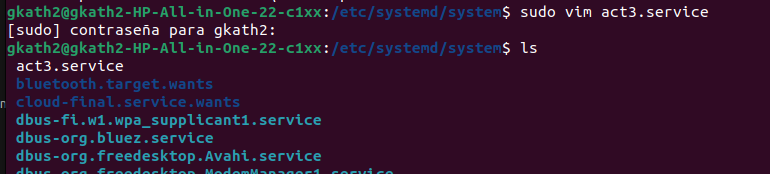
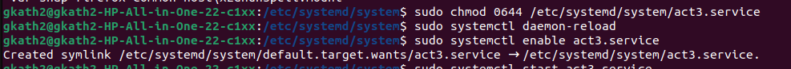
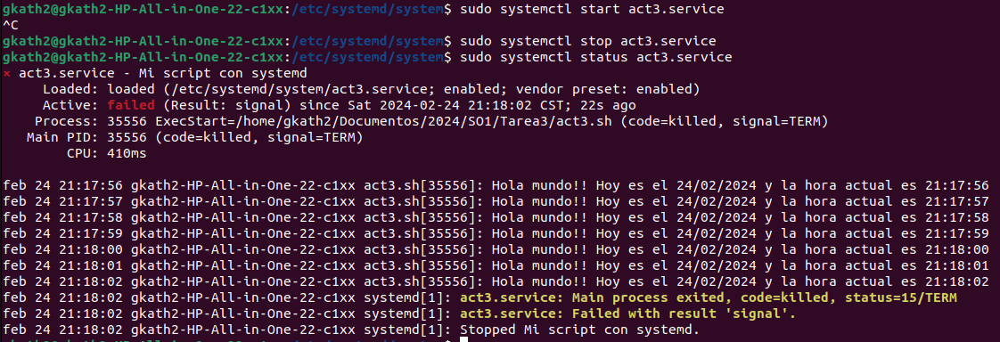

# Actividad 3

## Datos

Carnet | Nombre Completo
------ | --------------- 
202100075 | Katherinne Gabriela Gómez Marroquin

## Descripción
A continuación se explicará el proceso para crear un systemd unit de tipo servicio que ejecuta un script que imprime un saludo y la fecha actual infinitamente con una pausa de un segundo. Este servicio se habilitará para que inicie con el sistema. 

##  Proceso de Creación e Instalación
### Crear Script
Se crea un script con el siguiente contenido.
~~~
#!/bin/bash

while [ true ]
do
    DIA=`date +"%d/%m/%Y"`
    HORA=`date +"%H:%M:%S"`
    echo "Hola mundo!! Hoy es el $DIA y la hora actual es $HORA"
    sleep 1
done
~~~

Se utiliza un ciclo while true para que este se ejecute infinitamente, en las variables DIA y HORA se almacenan los valores actuales de la fecha y hora del sistema. El comando echo imprime el saludo y con sleep se detiene el proceso por 1 segundo.

Se le otorgan permisos de ejecución al script con el comando:
~~~
sudo chmod +x act3.sh
~~~

### Crear Unidad de Servicio
Se crea la unidad de servicio en el archivo /etc/systemd/system/act3.service:
~~~
[Unit]
Description=Mi script con systemd
After=network.target

[Service]
ExecStart=/home/gkath2/Documentos/2024/SO1/Tarea3/act3.sh
Type=oneshot
RemainAfterExit=true

[Install]
WantedBy=default.target
~~~
Donde:

* Description: información descriptiva que es mostrada en el log de journal de systemd cuando ejecutamos «systemctl status servicio.service«
* After: indica el servicio luego del cual correrá nuestro script. Se pueden agregar otros servicios separándolos por un espacio en blanco.
* ExecStart: permite especificar la ruta completa al script que se va a ejecutar.
* Type: forking en este caso es utilizado por daemons o residentes para que realicen una clonación de la llamada al sistema. El proceso principal del servicio es creado con un pid especificado en el archivo de pid escrito a continuación.
* WantedBy: especifica dentro de qué «target» de systemd debe ser instalado. En este caso se dejará en default.target.

Se le otorgan permisos al nuevo archivo .service:
~~~
chmod 0644 /etc/systemd/system/act3.service
~~~

Después de crear la unidad de servicio, o de modificarla, siempre se debe ejecutar el comando:
~~~
systemctl daemon-reload
~~~
### Habilitar y Ejecutar

Para habilitar el servicio se utiliza el comando:
~~~
systemctl enable act3.service
~~~
Y para ejecutarlo:
~~~
systemctl start act3.service
~~~

### Ver Logs
Para poder visualizar los logs y un pequeño resumen de del estado del servicio se utiliza:
~~~
systemctl status act3.service
~~~
## Evidencias

