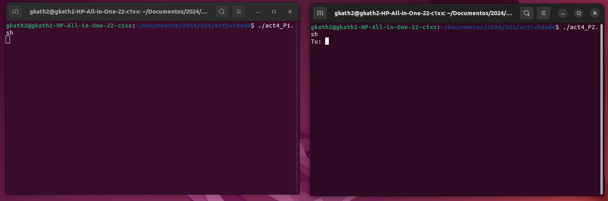
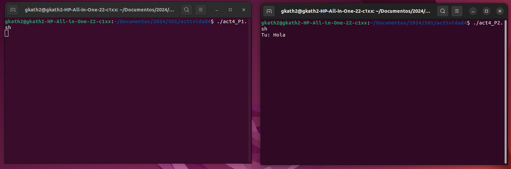
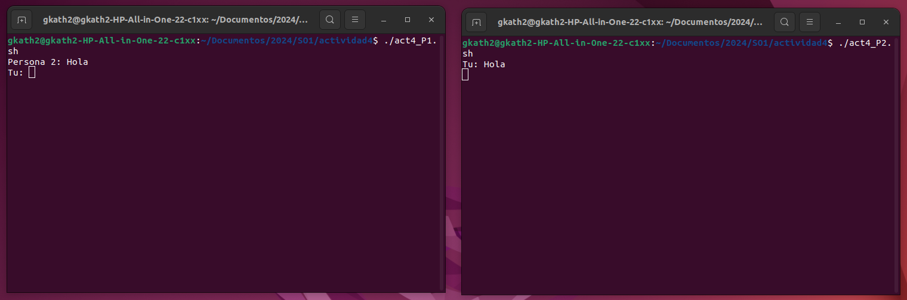
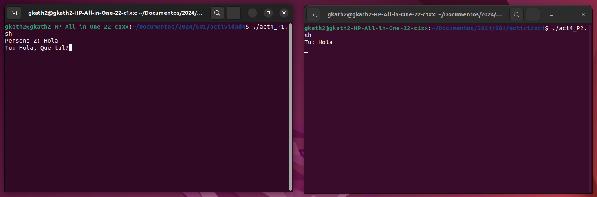
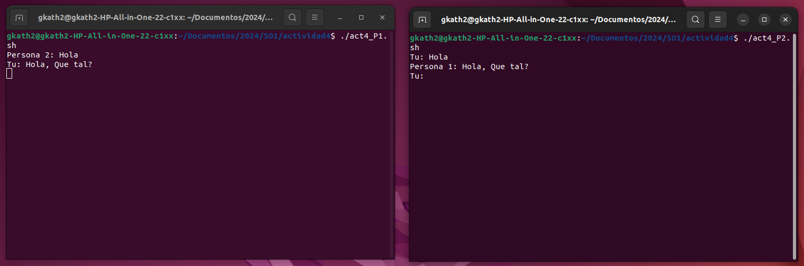
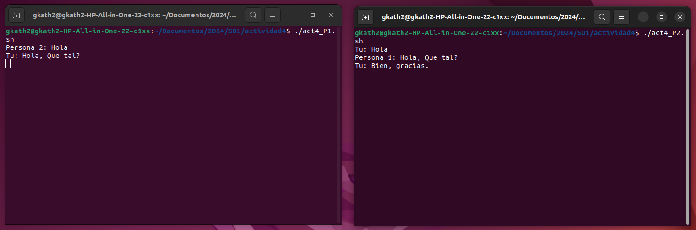

# Actividad 1

## Datos

Carnet | Nombre Completo
------ | --------------- 
202100075 | Katherinne Gabriela Gómez Marroquin

## Named Pipes
A continuación se presenta la creación de un chat básico (únicamente dos participantes) utilizando Named Pipes y bash en Linux.

Se crearon dos scripts **act4_P1.sh** y **act4_P2.sh**
### act4_P1.sh
~~~
#!/bin/bash

pipe=./mypipe
pipe2=./mypipe2

trap "rm -f $pipe2 $pipe" EXIT

if [[ ! -p $pipe ]]; then
    mkfifo $pipe
fi
if [[ ! -p $pipe2 ]]; then
    mkfifo $pipe2
fi

while true
do
    if read line <$pipe; then
        if [[ "$line" == 'Persona 2: bye' ]]; then
            break
        fi
        echo $line
        read -p "Tu: " mensaje
        echo "Persona 1: $mensaje" >$pipe2
    fi
done

echo "Chat finalizado"
~~~

Se guarda en las variables pipe y peipe2 la ruta de los named pipes, `trap` especifica qué comando se ejecuta al recibir determinada señal, en este caso, `rm -f $pipe2 $pipe` se ejecuta cuando el script finaliza `EXIT`. Los named pipe se crean solamente si estos no existen.

En un ciclo `while true` se lee el contenido de *pipe* si este contiene el mensaje "Persona 2: bye" el ciclo se rompe, de lo contrario se muestra su contenido en consola. Seguidamente se le pide al participante que ingrese su respuesta y la envia a través del *pipe2*.

### act4_P2.sh
~~~
#!/bin/bash

pipe=./mypipe
pipe2=./mypipe2

trap "rm -f $pipe $pipe2" EXIT

if [[ ! -p $pipe ]]; then
    echo "Persona 2 se desconectó. Finalizando chat."
    exit 1
fi

if [[ ! -p $pipe2 ]]; then
    echo "Persona 1 se desconectó. Finalizando chat."
    exit 1
fi

while true
do 
    read -p "Tu: " mensaje
    echo "Persona 2: $mensaje" >$pipe

    if read line <$pipe2; then
        if [[ "$line" == 'Persona 1: bye' ]]; then
            break
        fi
        echo $line
    fi
done

echo "Chat finalizado"
~~~

En este segundo script se verifica que los named pipes existan, si no existen se finaliza la ejecución. En el ciclo `while true` se solicita que se ingrese el mensaje y se envía a través de *pipe*. Posteriormente, se lee el contenido de *pipe2*, si este contiene el mensaje "Persona 1: bye" el ciclo se rompe, de lo contrario se muestra.

## En Funcionamiento
Se ejecutan ambos scrpits.

El participante que pertenece al segundo script envía el primer mensaje.

El participante del primer script recibe el mensaje enviado y se habilita la respuesta.

El participante del primer script escribe y envía su respuesta.

El participande del segundo script recibe el mensaje y...

... es su turno de responder.

El particpante del primer script, se despide y finaliza el chat.

