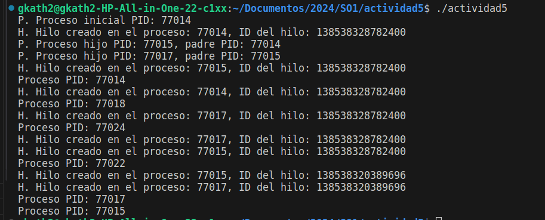

# Actividad 5

## Datos

Carnet | Nombre Completo
------ | --------------- 
202100075 | Katherinne Gabriela Gómez Marroquin

## Prueba de Procesos e Hilos
Se ha completado el programa para que sea ejecutable y con base en varias pruebas se responderá a las preguntas planteadas:

* ¿Cuántos procesos únicos son creados? Se crean 6 procesos únicos.
* ¿Cuántos hilos únicos son creados? Se crean 2 hilos únicos.

## Programa en Funcionamiento

