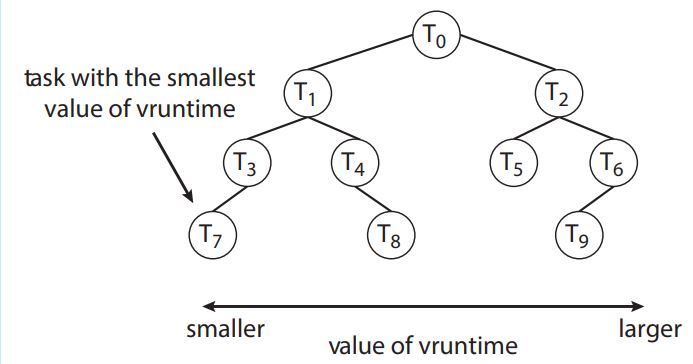

# Actividad 7

## Datos

Carnet | Nombre Completo
------ | --------------- 
202100075 | Katherinne Gabriela Gómez Marroquin

## Completely Fair Scheduler (CFS) de Linux
CFS proporciona justamente a cada tarea una parte de los recursos del procesador de una manera sencilla y muy eficiente.

Linux utiliza un enfoque modular para la programación del procesador en el sentido de que se pueden implementar diferentes algoritmos para programar diferentes tipos de procesos.

### Classic Preemptive Scheduling

Unix popularizó la programación preventiva clásica. Este modelo de programación se basa en que existe un intervalo de tiempo fijo para que una tarea retenga un procesador hasta que sea reemplazada por otra. Si un preempted process no ha terminado su trabajo, el proceso debe reprogramarse. Este modelo es poderoso porque admite concurrencia a través del tiempo compartido del procesador.

El modelo clásico normalmente incluye varias colas de programación, una por prioridad de proceso: cada proceso en una cola de mayor prioridad se programa antes que cualquier proceso en una cola de menor prioridad.

### CFS

CFS deja de utilizar intervalos fijos y prioridades explícitas. CFS determina la cantidad de tiempo para una tarea en un procesador dinámicamente a medida que el contexto de programación cambia durante la vida útil del sistema.

El planificador CFS tiene una latencia objetivo, que es la cantidad mínima de tiempo (idealizada a una duración infinitamente pequeña) necesaria para que cada tarea ejecutable se ejecute al menos una vez en el procesador. Por supuesto, una duración idealizada infinitamente pequeña debe aproximarse en el mundo real, y la aproximación predeterminada es 20 ms. Luego, cada tarea ejecutable obtiene una porción 1/N de la latencia objetivo, donde N es el número de tareas. 

Por ejemplo, si la latencia objetivo es de 20 ms y hay cuatro tareas en competencia, entonces cada tarea obtiene un intervalo de tiempo de 5 ms. Lo justo en CFS pasa a primer plano en la porción 1/N asignada a cada tarea que compite por un procesador.

El segmento 1/N es, de hecho, un segmento de tiempo, pero no fijo porque dicho segmento depende de N, el número de tareas que compiten actualmente por el procesador y el sistema cambia con el tiempo. Algunos procesos terminan y se generan otros nuevos; Los procesos ejecutables se bloquean y los procesos bloqueados se vuelven ejecutables.

CFS asigna una proporción del tiempo de procesamiento de la CPU a cada tarea. Esta proporción se calcula en función del nice value asignado a cada tarea. Los nice values oscilan entre −20 y +19, donde un nice value numéricamente más bajo indica una prioridad relativa más alta. Las tareas con nice value más bajos reciben una mayor proporción de tiempo de procesamiento de la CPU que las tareas con nice value más altos. El nice value predeterminado es 0.

CFS registra el tiempo de ejecución virtual de cada tarea utilizando la variable vruntime. El tiempo virtual de ejecución se asocia con un factor de deterioro basado en la prioridad de la tarea: las tareas con baja prioridad tienen valores más altos de deterioro. Y para decidir qué trea se ejecutará a continuación, el planificador solo debe seleccionar la tarea con el vruntime más bajo.

El sistema CFS necesita estructuras de datos eficientes para funcionar correctamente y crear un cronograma de tareas. De modo que la cola de ejecución no es implementada de la forma tradicional (FIFO) sino que se utiliza un árbol rojo-negro, un árbol binario de búsqueda donde la llave es el vruntime. Esto permite que las operaciones de inserción y eliminación se ejecuten en un tiempo O(log N).

